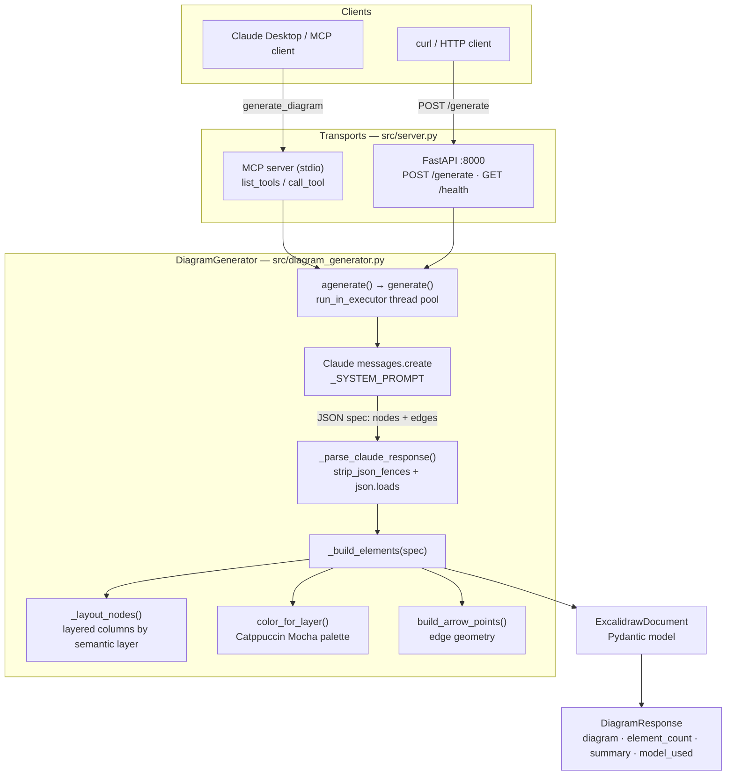

# MCP Diagram Agent

[](https://www.python.org/downloads/)
[](https://modelcontextprotocol.io/)
[](https://docs.anthropic.com/)
[](LICENSE)
[](https://github.com/astral-sh/ruff)

> **Turn a paragraph of text into a visual, editable architecture diagram — in seconds.**

MCP Diagram Agent is a [Model Context Protocol](https://modelcontextprotocol.io/) server that accepts a natural language description of a software system and returns an [Excalidraw](https://excalidraw.com/)-compatible JSON diagram you can import and edit immediately. Claude only ever produces a structured **node/edge spec** — the layout, layer-aware coloring, and Excalidraw serialization are deterministic Python, so the same spec always renders the same diagram.

The same generator is exposed over **two transports**: an MCP `stdio` server (the `generate_diagram` tool, for Claude Desktop and other MCP clients) and a **FastAPI REST API** (`POST /generate`) for any HTTP client.

---

## Architecture

A request enters through either transport and converges on a single lazily-initialized `DiagramGenerator`. The LLM boundary is narrow by design: Claude returns a JSON spec of nodes (`id`, `label`, `layer`, `shape`) and edges (`from`, `to`, `label`, `style`), and everything visual after that is computed locally and unit-tested.



---

## How it works

The design keeps the LLM responsible only for *semantics* and the code responsible for *rendering* — this makes output deterministic, testable, and cheap.

1. **Narrow LLM contract.** `_SYSTEM_PROMPT` constrains Claude to emit a strict JSON object: a `summary`, a list of `nodes` (`id`, `label`, `layer`, `shape`, `description`) and a list of `edges` (`from`, `to`, `label`, `style`). No coordinates, colors, or Excalidraw internals are ever asked of the model.
2. **Fence-tolerant parsing.** `_parse_claude_response()` runs the raw text through `strip_json_fences()` before `json.loads()`, so ```` ```json ```` wrappers never break the pipeline.
3. **Deterministic layered layout.** `_layout_nodes()` groups nodes by semantic layer (`client → gateway → service → queue → data → external → default`), assigns each layer its own column (+280px per layer) and stacks nodes vertically within a layer (+140px each). Layout is pure arithmetic — no randomness, no LLM.
4. **Layer-aware styling.** `_build_elements()` maps each node's `shape` string to an `ElementType` enum and resolves stroke/fill via `color_for_layer()` using the [Catppuccin Mocha](https://github.com/catppuccin/catppuccin) palette; edges become Excalidraw arrows whose points are computed by `build_arrow_points()` (center-right of source → center-left of target), honoring solid/dashed/dotted styles.
5. **Validated, importable output.** Elements are assembled into an `ExcalidrawDocument` (Pydantic v2) and serialized through `model_dump_excalidraw()`, which emits the exact key shape Excalidraw expects per element type. Hex colors are enforced by a validator (`#RRGGBB` or `transparent`). The result is wrapped in a `DiagramResponse` (`element_count` clamped to `max_elements`).
6. **Non-blocking by default.** `agenerate()` runs the synchronous `generate()` in a thread pool via `loop.run_in_executor()`, so the async REST/MCP handlers never block the event loop on the Anthropic call.

---

## Quick Start

```bash
# 1. Clone
git clone https://github.com/shaikn6/mcp-diagram-agent.git && cd mcp-diagram-agent

# 2. Set your API key
echo "ANTHROPIC_API_KEY=sk-ant-..." > .env

# 3. Start with Docker
docker-compose up --build

# 4. Generate a diagram
curl -s -X POST http://localhost:8000/generate \
  -H "Content-Type: application/json" \
  -d '{"description": "Microservices app: API gateway, auth service, user service, PostgreSQL"}' \
  | python -m json.tool

# 5. Paste the "diagram" field contents into https://excalidraw.com/
```

---

## MCP Usage

Add this server to your MCP client (e.g. Claude Desktop `claude_desktop_config.json`):

```json
{
  "mcpServers": {
    "diagram-agent": {
      "command": "python",
      "args": ["-m", "src.server", "--mcp"],
      "env": {
        "ANTHROPIC_API_KEY": "sk-ant-..."
      }
    }
  }
}
```

Then in Claude Desktop, use the `generate_diagram` tool:

```
Generate a diagram for: "Event-driven e-commerce platform with Kafka,
order service, inventory service, payment service, and Redis cache."
```

Claude will call `generate_diagram` and return Excalidraw JSON you can paste directly into [excalidraw.com](https://excalidraw.com/).

---

## REST API Usage

### `POST /generate`

```bash
curl -X POST http://localhost:8000/generate \
  -H "Content-Type: application/json" \
  -d '{
    "description": "Three-tier web app: React SPA, Node.js REST API, MongoDB Atlas",
    "style": "technical",
    "max_elements": 20
  }'
```

**Response:**

```json
{
  "diagram": {
    "type": "excalidraw",
    "version": 2,
    "elements": [ ... ],
    "appState": { "viewBackgroundColor": "#ffffff" },
    "files": {}
  },
  "element_count": 9,
  "description_summary": "Three-tier web architecture with React frontend, Node.js API, and MongoDB.",
  "model_used": "claude-3-5-sonnet-20241022"
}
```

### `GET /health`

```bash
curl http://localhost:8000/health
# {"status":"ok","version":"0.1.0","service":"mcp-diagram-agent"}
```

Interactive docs are available at `http://localhost:8000/docs`.

---

## Environment Variables

| Variable | Required | Default | Description |
|----------|----------|---------|-------------|
| `ANTHROPIC_API_KEY` | **Yes** | — | Your Anthropic API key |
| `CLAUDE_MODEL` | No | `claude-3-5-sonnet-20241022` | Claude model to use |
| `HOST` | No | `0.0.0.0` | Bind host for the REST server |
| `PORT` | No | `8000` | Bind port for the REST server |
| `LOG_LEVEL` | No | `info` | Logging level (`debug`, `info`, `warning`, `error`) |
| `RELOAD` | No | `false` | Enable hot-reload (development only) |
| `CORS_ORIGINS` | No | `*` | Comma-separated allowed CORS origins |

Copy `.env.example` to `.env` to get started.

---

## Local Development

```bash
# Install with dev extras
pip install -e ".[dev]"

# Run all tests
pytest

# Lint + format
ruff check src/ tests/ && ruff format src/ tests/

# Type check
mypy src/

# Run the API server with auto-reload
RELOAD=true python -m src.server
```

---

## Supported Diagram Elements

| Shape | Excalidraw type | Semantic layer |
|-------|----------------|----------------|
| Rectangle | `rectangle` | services, gateways, data stores |
| Ellipse | `ellipse` | clients, external systems |
| Diamond | `diamond` | decision points |
| Arrow | `arrow` | data flow, API calls |

Layer colors follow the [Catppuccin Mocha](https://github.com/catppuccin/catppuccin) palette for a cohesive look:

| Layer | Color |
|-------|-------|
| `client` | Sky blue |
| `gateway` | Red |
| `service` | Green |
| `data` | Peach |
| `queue` | Yellow |
| `external` | Mauve |

---

## Tests

The deterministic core (parsing, layout, color mapping, arrow geometry, Pydantic serialization, and both transports) is covered by **149 tests** (`pytest --co -q`) across `test_server.py`, `test_diagram_generator.py`, and `test_comprehensive.py`. The project enforces a **95% coverage gate** (`--cov-fail-under=95` in `pyproject.toml`) so the non-LLM logic stays fully exercised.

```bash
pytest                    # full suite with coverage
```

---

## Tech stack

Python 3.11 · `mcp` (Model Context Protocol SDK) · `anthropic` (Claude Sonnet) · `fastapi` + `uvicorn` (REST transport) · `pydantic` v2 (validation + Excalidraw serialization) · `python-dotenv`. Built with Hatchling, tested with `pytest` (+ `pytest-asyncio`, `pytest-cov`), linted with `ruff`, type-checked with `mypy --strict`.

---

## Contributing

See [CONTRIBUTING.md](CONTRIBUTING.md). All contributions are welcome — bug reports, feature requests, and pull requests.

---

## Security

See [SECURITY.md](SECURITY.md) for the vulnerability disclosure policy.

---

## License

MIT — see [LICENSE](LICENSE).
